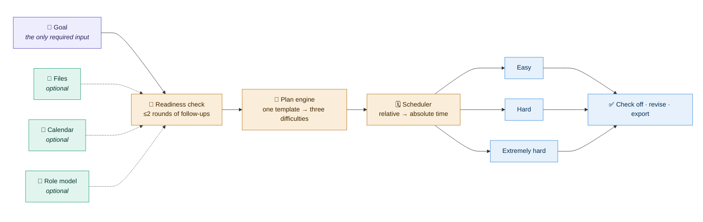
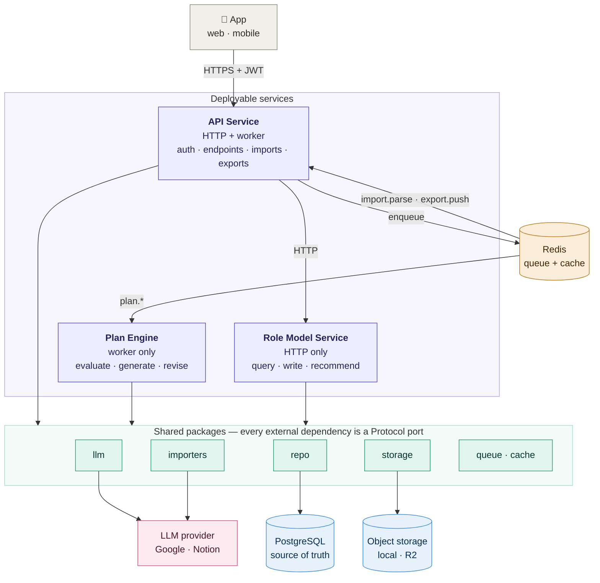
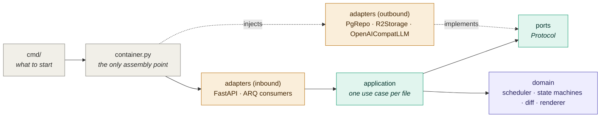
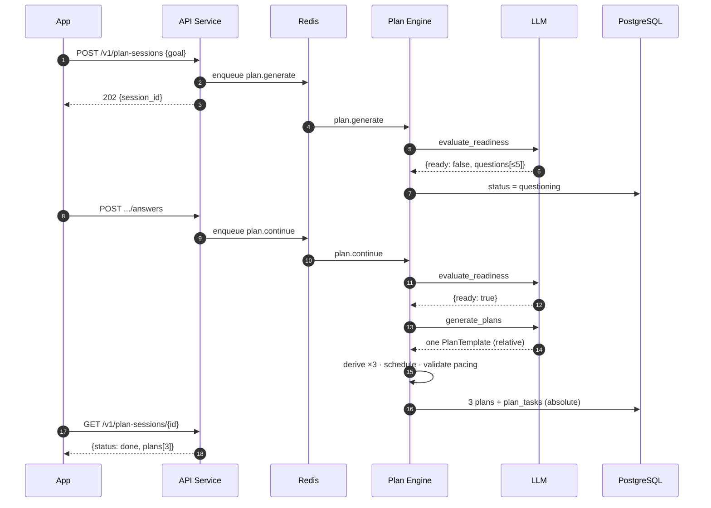

<div align="center">

# guru-core

**Turn a goal into a plan you can actually execute.**

State what you want to achieve. The system merges whatever context it has, asks
follow-up questions only where something essential is missing, and produces three
difficulty variants of a scheduled plan — exportable to Google Calendar or Markdown,
checked off day by day, and revisable when you fall behind.

[](https://www.python.org/)
[](https://fastapi.tiangolo.com/)
[](https://www.postgresql.org/)
[](https://redis.io/)
[](https://mypy-lang.org/)
[](https://docs.astral.sh/ruff/)
[](#testing)
[](LICENSE)

[Specification](guru-core-PRD.md) · [Engineering rules](CONTRIBUTING.md) · [Quick start](#quick-start)

</div>

---

## How it works



**The design decision that matters:** the LLM never does calendar arithmetic. It produces
one *relative* plan template — "a long run on Saturday morning, 45 minutes" — and a
deterministic scheduler turns that into absolute timestamps that avoid your existing
commitments. The three difficulty variants are derived from that one template by
coefficients, not by three separate model calls. So the model is asked for judgement,
never for arithmetic: cheaper, testable, and stable across runs.

## Architecture

Three independently deployable services share six packages, one PostgreSQL and one Redis.
Services never call each other over HTTP — they communicate through the queue and the
shared database.



| Service | Shape | Owns |
|---|---|---|
| **API Service** | HTTP + worker | Auth, OAuth, every app-facing endpoint, import parsing, export push, job enqueueing |
| **Plan Engine** | Worker only | Context assembly, readiness evaluation, follow-up questions, plan generation, revisions |
| **Role Model Service** | HTTP only | Role model queries, team writes, LLM-backed recommendation |

### Hexagonal, enforced by tooling

Dependencies point one way only. `import-linter` fails the build on a reverse import, so
the rule cannot rot.



Every port has a real implementation **and** a fake, which is why the unit and
application suites need no Docker, no database and no network:

| Port | Real | Fake |
|---|---|---|
| `LLMPort` | `OpenAICompatLLM`, `AnthropicLLM` | `FakeLLM` (fixtures) |
| `StoragePort` | `LocalFileStorage`, `R2Storage` | `InMemoryStorage` |
| `QueuePort` | `ArqQueue` | `InMemoryQueue` |
| `CachePort` | `RedisCache` | `DictCache` |
| `XxxRepo` ×14 | `PgXxxRepo` ×14 | `InMemoryXxxRepo` ×14 |
| `SourcePort` / `ParserPort` | 7 parsers, Google Calendar | `InMemorySource` |

### From goal to calendar



Model output is validated twice — Pydantic for shape, then business rules for
sense — and a failure feeds the specific violation back for a retry. If the retries run
out, the plan degrades to a conservative default and says so in `assumptions[]` rather
than shipping something unschedulable.

## Quick start

Requires Python 3.12, [uv](https://docs.astral.sh/uv/), PostgreSQL and Redis.

```bash
uv sync
cp .env.example .env                  # adjust as needed
uv run alembic upgrade head           # create the schema
uv run python -m cmd.seed_role_models # load the 12 role models
make check                            # ruff → mypy --strict → import-linter → pytest
```

Run it, four processes:

```bash
uv run python -m cmd.api_server          # HTTP, port 8000
uv run python -m cmd.api_worker          # import.parse · export.push
uv run python -m cmd.plan_engine_worker  # plan.generate · continue · revise
uv run python -m cmd.role_model_server   # HTTP, port 8001
```

Or the whole stack in containers — **one image, six roles**, the entrypoint decides which:

```bash
docker compose up -d --build
docker compose exec api python -m alembic upgrade head
docker compose exec api python -m cmd.seed_role_models
bash scripts/smoke.sh                 # end-to-end: sign in → plan → tasks → export
```

Compose publishes postgres and redis on 5433 / 6380 so they do not collide with the
services already running on your machine.

## Configuration

Everything lives in `config/` and environment variables. Swapping a vendor never touches
application code.

| File | Controls |
|---|---|
| `config/llm.yaml` | Provider, per-purpose parameters, context budgets, retry count |
| `config/readiness_metrics.yaml` | What must be known before a plan can be generated |
| `config/scheduler.yaml` | Minimum gap between tasks, conflict shift limit, slot order |
| `config/difficulty_coefficients.yaml` | How the three variants are derived |
| `config/tag_vocab.yaml` | Role model tag namespaces and controlled values |
| `config/calendar_colors.yaml` | Google Calendar colour mapping |

<details>
<summary><b>Switching LLM provider</b> — environment variables only</summary>

<br>

| Setup | `LLM_ADAPTER` | `LLM_BASE_URL` | `structured_output` |
|---|---|---|---|
| Tests and development | `fake` | — | — |
| Local vLLM | `openai_compat` | `http://localhost:8000/v1` | `guided_json` |
| Local Ollama | `openai_compat` | `http://localhost:11434/v1` | `json_schema` |
| Claude | `anthropic` | — | `tool_use` |

The whole system makes exactly four kinds of LLM call — evaluate readiness, generate a
plan, revise a plan, recommend a role model. Everything else is deterministic code.

</details>

<details>
<summary><b>Switching object storage</b> — local filesystem or Cloudflare R2</summary>

<br>

```bash
STORAGE_BACKEND=r2
R2_ACCOUNT_ID=...
R2_ACCESS_KEY_ID=...
R2_SECRET_ACCESS_KEY=...
R2_BUCKET=...
```

`container.py` is the only assembly point, so no use case changes. All three
implementations run the same contract test suite.

</details>

## Testing

```bash
make check          # ruff → mypy --strict → import-linter → pytest, no Docker
make integration    # integration tests against a live PostgreSQL
bash scripts/smoke.sh
```

| Suite | Count | Needs |
|---|---|---|
| Unit — domain, packages | ~450 | nothing |
| Application — use cases through fakes | ~250 | nothing |
| Integration — Postgres repos | 31 | PostgreSQL |
| Smoke — end to end over HTTP | 1 script | the full stack |

The heaviest coverage sits on the deterministic core: the scheduler, difficulty
derivation, the revision diff, and the state machines. That is where regressions would
be invisible and expensive.

## Repository layout

```
cmd/            six entry points, ≤30 lines each, zero business logic
packages/       llm · importers · repo · storage · queue · cache · config · logging
services/
  api/          domain · application · adapters · container.py
  plan_engine/  domain · application · adapters · container.py
  role_model/   domain · application · adapters · container.py
config/         yaml the code reads, never hard-coded
seeds/          role model starting samples
migrations/     alembic
tests/          unit · application · integration · fixtures
```

## Language

The codebase is English-only. Files that carry *content* rather than code — LLM prompts,
readiness metrics, role model seeds, fixtures — keep their original language. See
[`CONTRIBUTING.md`](CONTRIBUTING.md#language).

## License

[Apache 2.0](LICENSE)
