# guru-core — 後端 MVP 產品需求文件（PRD）

| 項目 | 內容 |
|---|---|
| 專案 | guru-core（coach.ai 後端） |
| Repo | github.com/Quasar-Gang/guru-core |
| 版本 | v0.1 MVP |
| 日期 | 2026-09-05 |
| 狀態 | v0.2 Draft（待決事項僅剩託管平台；本地模型已完成 demo 選型） |

---

## 1. 產品概述

### 1.1 一句話

使用者輸入目標，可選擇性補上既有文件、Google Calendar 與 role model；系統以 LLM 整併資料、必要時追問，產出三種難度的可執行計畫，能匯出到 Google Calendar 或 Markdown、逐項勾選完成，並在落後或行程變動時提出修訂。

### 1.2 核心使用者流程

```
用戶輸入 ──► AI 彙整與追問（≤2 輪）──► 計劃引擎 ──► 三種難度計畫 ──► 匯出 / 內建行事曆 / 修訂
                                          ▲
                              Role model 資料庫
```

### 1.3 MVP 範圍

**做：**
- Google 登入
- 目標建立：目標為唯一必填；期程、每週投入量、目前起點、作息與慣用時間管理法為選填（見 3.3）
- 匯入：Google Calendar（P0）、檔案上傳（csv / xlsx / md / html / pdf / docx）
- Role model：兩大類——基本特質類（輕鬆寫意 / 穩扎穩打 / 地獄模式…）與角色卡類（Stephen Curry 型…，帶 tags）；用戶各選至多一個；LLM 依用戶資料推薦角色卡類 ≤3 個；資料由團隊透過 API 寫入
- Plan Engine：指標評估 → follow-up 選擇題（≤5 題 × 3 個客製選項，可 skip / 自由回答，最多 2 輪）→ 生成 Easy / Hard / Extremely hard 三份計畫
- 計畫管理：列表、選定要執行的難度、改名、封存、刪除、查看進度
- 內建行事曆 / Todo（`plan_tasks`）：勾選完成、改時間
- 匯出：Google Calendar（P0，含任務改動後重新同步）、Markdown（P0，下載或複製）、Google Sheets（P1）、Notion（P1）
- 完成情況：每日 check-in，任務標 done / missed / skipped，計畫顯示達成率
- 計畫修訂（Revision）：用戶標記未達標後手動觸發，Plan Engine 依選定策略（延後截止日 / 降低目標）產出修訂版，用戶看 diff 決定是否套用

**不做（留到 v0.2+）：**
- 履歷解析（P2）、Apple Health（P3）
- 用戶把自己的計畫發布成 role model、marketplace、社群 thread
- Role model 背景調查（LLM + web search 自動產生角色卡）
- Role model 向量搜尋、程式計分排序（seed 量少，MVP 直接讓 LLM 從全部候選挑）
- Calendar 變化偵測與自動重排（`calendar.poll`、`calendar_change` 觸發）
- 每日自動修訂（`auto_revise`、自動套用與還原）
- `compress`（塞入）修訂策略
- 多人協作、團隊功能
- 獨立 API Gateway、微服務網格

---

## 2. 系統架構

### 2.1 拆分原則

三個可獨立部署的 service，六個共用套件（`llm`、`importers`、`repo`、`storage`、`queue`、`cache`），一個 PostgreSQL、一個 Redis、一個 R2。**API Gateway 合併進 API Service**，App 只對接一個端點。Service 之間不互相 HTTP 呼叫，只透過佇列與共用 DB（經 `repo` 套件）溝通。

### 2.2 High-level 架構圖

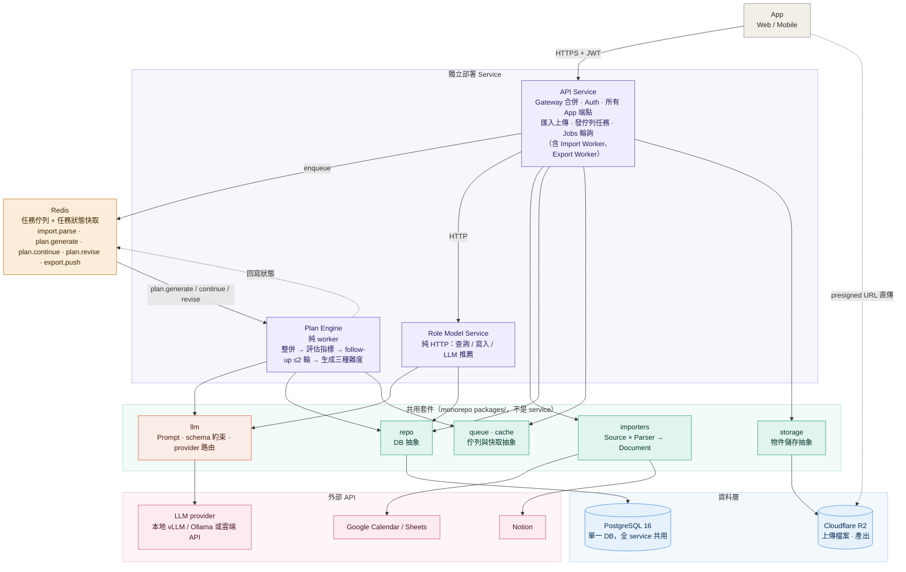

### 2.3 Service 職責

| Service | 型態 | 負責 | 不負責 |
|---|---|---|---|
| **API Service** | HTTP + worker | Auth、OAuth 連線管理、所有 App 端點、匯入上傳與解析、匯出推送、發佇列任務、Jobs 狀態查詢 | 呼叫 LLM、生成計畫 |
| **Plan Engine** | 純 worker | 整併資料、評估指標、產生 follow-up、生成計畫、產生修訂版與 diff | 對外 HTTP |
| **Role Model Service** | 純 HTTP | Role model 查詢、團隊寫入、LLM 推薦（只推角色卡類） | 計畫生成、背景調查、任何背景任務 |

### 2.4 共用套件

| 套件 | 公開 Port | 正式實作 | Fake 實作 |
|---|---|---|---|
| `llm` | `LLMPort.complete(prompt_name, context, output_schema, purpose) -> BaseModel` | `OpenAICompatLLM`、`AnthropicLLM` | `FakeLLM`（讀 fixtures） |
| `importers` | `SourcePort.fetch() -> RawBlob`、`ParserPort.parse(RawBlob) -> Document` | `GoogleCalendarSource`、`UploadSource`、`CsvParser`… | `InMemorySource`、`PassthroughParser` |
| `repo` | 每張表一個 `XxxRepo` Protocol | `PgXxxRepo`（SQLAlchemy 2.0 async） | `InMemoryXxxRepo` |
| `storage` | `StoragePort.put / get / presign` | `R2Storage`（boto3 S3 API） | `InMemoryStorage` |
| `queue` | `QueuePort.enqueue(job) / consume(name)` | `ArqQueue` | `InMemoryQueue` |
| `cache` | `CachePort.get / set / expire` | `RedisCache` | `DictCache` |

---

## 3. 核心流程設計

### 3.1 Plan Session 狀態機

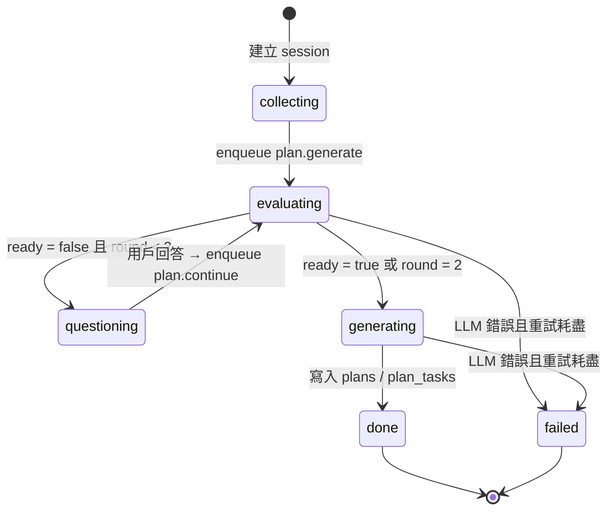

`plan_sessions.status` 是權威來源；Redis 只快取供 App 輪詢。

### 3.2 計畫生成時序

```mermaid
sequenceDiagram
  autonumber
  participant App
  participant API as API Service
  participant Q as Redis (ARQ)
  participant PE as Plan Engine
  participant LLM as llm 套件 → LLM provider
  participant DB as PostgreSQL

  App->>API: POST /plan-sessions {goal, trait_role_model_id?, persona_role_model_id?, import_ids?}
  API->>DB: insert plan_sessions(status=collecting)
  API->>Q: enqueue plan.generate(session_id)
  API-->>App: 202 {session_id, job_id}

  Q->>PE: plan.generate
  PE->>DB: 讀 profile / documents / role models /（若已連結）calendar events
  PE->>PE: 整併成 context
  PE->>LLM: complete("evaluate_readiness", context, ReadinessOutput)
  LLM-->>PE: {ready, missing[], questions[≤5]}

  alt ready = false 且 round < MAX_FOLLOWUP_ROUNDS
    PE->>DB: insert followup_rounds, status=questioning
    App->>API: GET /plan-sessions/{id}  (輪詢)
    API-->>App: {status: questioning, questions[]}
    App->>API: POST /plan-sessions/{id}/answers
    API->>DB: update followup_rounds.answers
    API->>Q: enqueue plan.continue(session_id)
    Q->>PE: plan.continue → 回到步驟 7
  else ready = true 或 round 用完
    PE->>DB: status=generating
    PE->>LLM: complete("generate_plans", context, PlansOutput)
    LLM-->>PE: 一份 hard PlanTemplate（相對排程）
    PE->>PE: 依係數推導 easy / extremely_hard 兩份
    PE->>PE: Scheduler 展開成絕對時間（違反 pacing 則退回 LLM 重生 ≤2 次）
    PE->>DB: insert plans(template, structure), plan_tasks; status=done
    App->>API: GET /plan-sessions/{id}
    API-->>App: {status: done, plans[]}
  end
```

### 3.3 目標建立流程（Onboarding）

原則：**只有目標是必填，其餘全部可 skip。** 額外資料與 Calendar 都是加分項，缺了計畫照樣產得出來，只是 `assumptions[]` 會長一點。

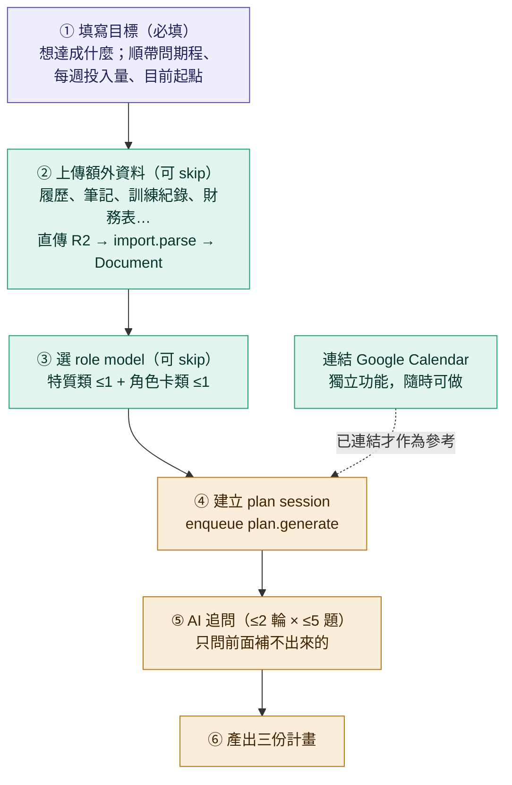

規則：

- **目標**是唯一必填。`horizon` / `capacity` / `baseline` 在此步順帶問但可留白，留白就到追問階段補，補不到走 `force_generate_rule`。
- **額外資料**走 presigned URL 直傳 R2，`import.parse` 解析成 `Document`（`events[] + text_chunks[]`）。這些內容進 context，也用來減少追問題數。
- **Calendar 連結是獨立功能，不是這條流程的一站。** 已連結就把 `events[]` 當既有行程給 Scheduler 避開；沒連結就完全不參考，計畫照排，只在 `assumptions[]` 註明「未參考既有行事曆」。只有在用戶按「匯出到 Google Calendar」而尚未連結時，才跳出連結提示（見 3.6）。
- **追問只補洞**：已能從基本題、上傳資料或 Calendar 推出的資訊不再問。

### 3.4 指標評估規則

指標清單放 `config/readiness_metrics.yaml`，不寫死在 prompt。每次 `evaluating` 把清單與 context 一起送給 LLM，要求回傳：

```json
{
  "ready": false,
  "missing": ["capacity", "baseline"],
  "questions": [
    {
      "id": "q1",
      "metric_id": "capacity",
      "text": "你平常大概能怎麼安排跑步時間？",
      "options": [
        "平日 2 個晚上 + 週六早上，每次約 40 分",
        "只有週末，兩天各 60 分",
        "幾乎每天早上 20–30 分"
      ],
      "allow_custom": true,
      "allow_skip": true
    }
  ]
}
```

選項是依「上班族、目標跑步」這個 context 生出來的具體安排，不是「少於 3 小時 / 3–7 小時 / 7 小時以上」這種通用區間——這是追問品質的關鍵，規則寫在 13.3。

規則：
- 最多回 5 題，每題恰好 3 個依用戶 context 客製的選項，並標明補的是哪個 `metric_id`
- 每題可 skip 或自由文字回答
- `MAX_FOLLOWUP_ROUNDS = 2`（config）
- 輪數用完仍不 ready → 走 `force_generate_rule`，缺項以保守預設補上並寫入 `assumptions[]`

### 3.5 計畫生命週期與 Google Calendar 同步

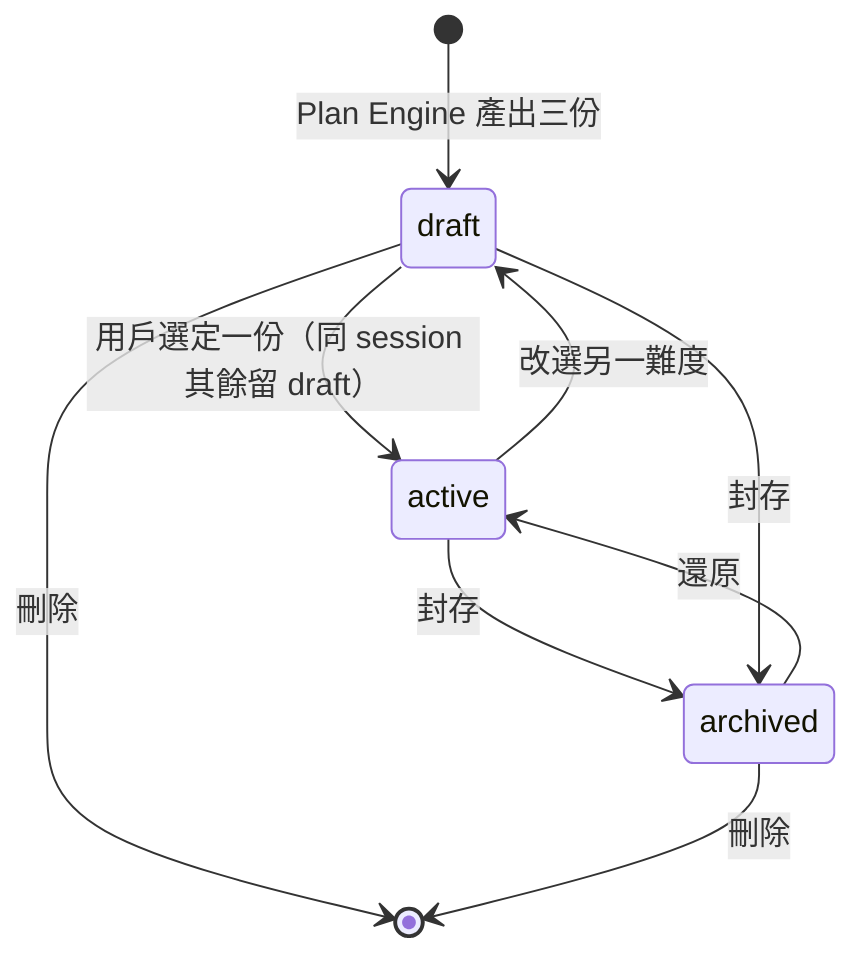

規則：
- 一個 session 同時只能有一份 `active`，內建行事曆與匯出只作用於 `active` 的計畫。
- 匯出 Google Calendar 走 `export.push`，`mode = full` 首次建立專屬 secondary calendar 與全部事件並回填 `plan_tasks.external_ref`；之後任務改時間、完成、刪除都以 `mode = incremental` 只同步變動的任務，比對 `synced_at`。
- 封存不動外部行事曆；刪除或解除匯出才刪外部事件。
- **單向同步：guru-core → Calendar，第一版不做反向同步。** 用戶直接在 Calendar 上改 guru 事件的時間，guru-core 不會回寫；下次 `export.push incremental` 會把它改回計畫的時間。App 在匯出設定旁註明這點，並引導用戶用 App 內的「改時間」而非直接動 Calendar。用戶在 Calendar 新增的其他行程，MVP 也不主動偵測——想避開就在 App 內按「重新排程」。

### 3.6 Google 連線（OAuth）

登入與 Calendar 授權分開：登入只要 `openid email profile`；用戶點「連線 Google Calendar」才要 `calendar.readonly`、`calendar.events`、`spreadsheets`，一次授權涵蓋匯入、Calendar 匯出、Sheets 匯出。App 從頭到尾拿不到 Google token，只拿自己的 JWT。

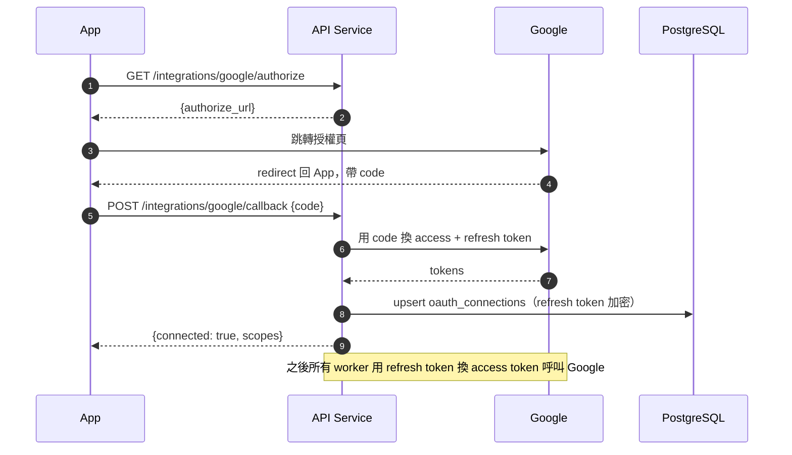

Token 失效：worker 拿到 `invalid_grant` 時寫 `revoked_at`，任務標 `failed: reauth_required`，`GET /integrations` 回 `needs_reauth = true`，App 提示重新連線。

### 3.7 完成情況與每日 check-in

**完成情況記錄在 guru-core 的 `plan_tasks`，不記在 Google Calendar。** Calendar 只是投影：事件過了時間不代表做了，也沒有可靠的「標記完成」語意。App 每天結束前推一則 check-in，列出當天任務讓用戶勾 done / missed / skipped，可附原因；`POST /plans/{id}/checkins` 一次寫入，同步更新 `plan_tasks.status`、`completed_at`、`missed_reason`。

已匯出 Calendar 的任務，check-in 後以 `export.push incremental` 把事件標題加上 ✓ / ✗ 前綴，讓用戶在 Calendar 也看得到，但那只是顯示，真相在 DB。

### 3.8 計畫修訂（Revision）

只有一種觸發：**用戶手動按「重新排程」**（通常是在標記 missed 之後）。

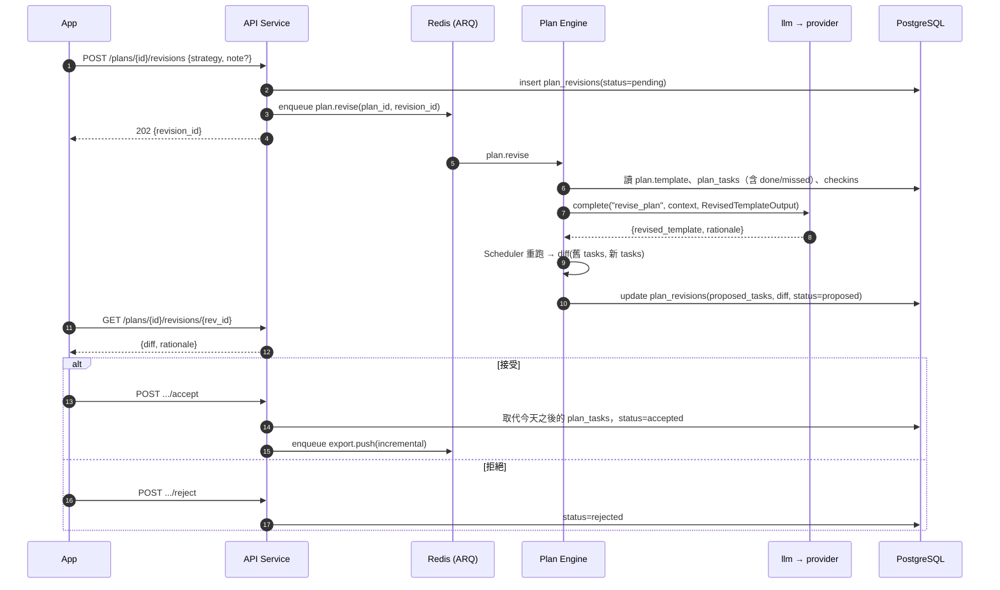

修訂規則：
- 只重排**今天之後**的任務，已 done / missed 的歷史不動。
- 修訂時 LLM 只改 `template`（模板層），Scheduler 重跑得出新的 `plan_tasks`；`diff` 以 `template_key + week_index + occurrence` 對齊，每筆標 `added / moved / removed / shortened / unchanged`，App 直接渲染，不靠 LLM 描述。
- 一個 plan 同時只能有一個 `pending / proposed` 的修訂。
- 剩餘時間不足以達標時，依用戶選的策略處理（見 3.8.1）；`rationale` 必須說明用了哪個策略、改了什麼。

#### 3.8.1 修訂策略

發起修訂時由用戶選，兩種：

| strategy | 做法 | 適合 | LLM 約束 |
|---|---|---|---|
| `postpone` 延後 | 保持目標與每週強度不變，把截止日往後推 | 目標不能降、時間有彈性 | 只能改 `plans.deadline` 與 `duration_weeks`，不能改任務內容與密度 |
| `reduce` 降標 | 保持截止日，把目標量縮到剩餘時間做得到的程度 | 截止日固定（考試、比賽） | 只能改目標數字與任務範圍，不能動截止日；`structure.goal_statement` 要更新並在 diff 標 `reduced` |

兩種策略都不能違反 trait 的 `pacing` 上限（`sessions_per_week[max]`、`rest_days_min`），違反時走 7.5 的驗證鏈重試。

### 3.9 Role model 推薦

Role Model Service 唯一用到 LLM 的地方。輸入用戶 profile（目標、可投入時間、起點、偏好），從資料庫取出**角色卡類**候選（依 tags 粗篩 ≤20 筆；`domain:` / `goal:` 由 LLM 從用戶目標推出，或由前端篩選帶入），經程式計分取前 8，再交給 LLM 依 `summary + applicability` 排序，回傳前 3 名與一句推薦理由。基本特質類不進推薦，由用戶自己挑。

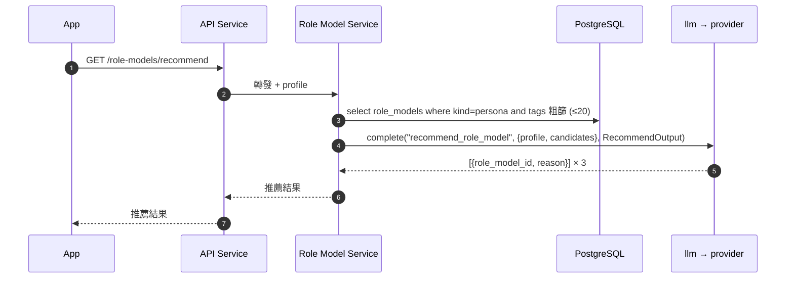

Plan Engine 使用方式：session 建立時帶 `trait_role_model_id`（可選）與 `persona_role_model_id`（可選），Engine 透過 `RoleModelRenderer` 依用途與 token 預算渲染 context（見 12.6）。特質類的 `pacing` 變成生成時的硬約束，角色卡類的 `sections` 提供方法論與里程碑結構。

### 3.10 匯入抽象

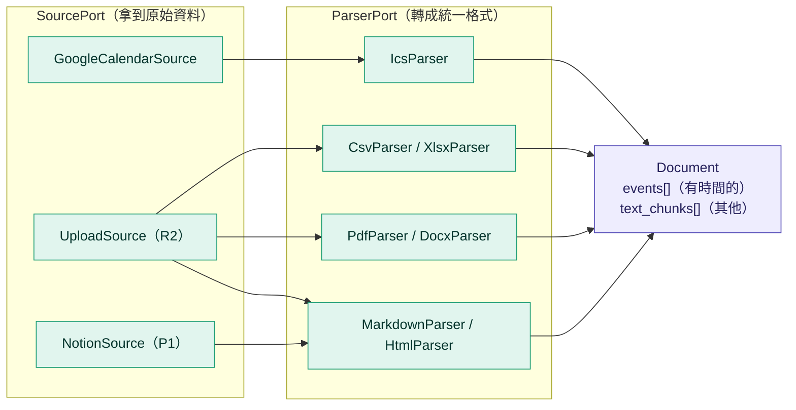

Plan Engine 只認 `Document`，不認來源與格式。

---

## 4. 資料模型

### 4.1 ERD

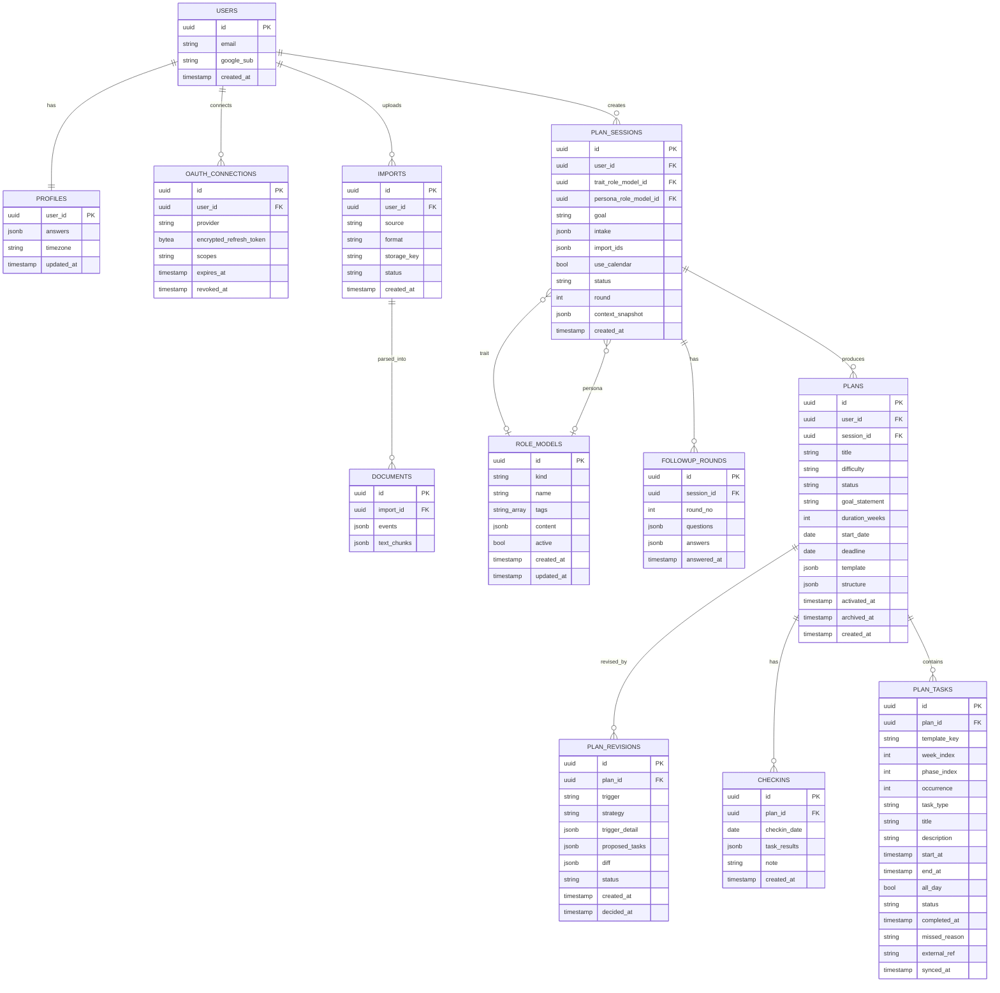

`plan_sessions` 幾個欄位的用途：`goal` 是唯一必填的用戶輸入；`intake` 放 onboarding 第一步順帶問到的 `horizon / capacity / baseline`（可為空）；`import_ids` 是本次納入的上傳資料；`use_calendar` 記錄建立當下是否已連結 Calendar，決定 Scheduler 要不要避開既有行程，也讓計畫可重現。

`checkins` 以 `UNIQUE (plan_id, checkin_date)` 保證一天一筆，重複提交為覆寫；`task_results` 是該次提交的快照，`plan_tasks.status` 才是權威值。

### 4.2 表格擁有者（只有 owner 可寫）

| 表 | Owner |
|---|---|
| users, profiles, oauth_connections, imports, documents, checkins | API Service |
| plan_sessions, followup_rounds | Plan Engine（建立與 answers 寫入由 API Service 負責，狀態轉移由 Plan Engine 負責） |
| plans, plan_tasks | Plan Engine 建立；建立後的管理欄位（title、status、任務完成與時間）由 API Service 寫 |
| plan_revisions | Plan Engine 建立與寫 `proposed_tasks / diff`；`status` 決定由 API Service 寫。`status` ∈ `pending`（待處理）、`proposed`（待用戶決定）、`accepted`、`rejected` |
| role_models | Role Model Service |

### 4.3 計畫資料格式

Happy path 三個要求——能匯出 Google Calendar、前端能清楚展示、能拆成可勾選的 task——決定了一個關鍵設計：**LLM 只產「相對排程」的計畫模板，具體日期時間由 Plan Engine 的 deterministic scheduler 算出來。** LLM 不做日曆算術，不會排到用戶已有的會議上，也不會算錯週幾。

```
LLM 輸出 PlanTemplate（相對時間）──► Scheduler（用戶時段 + 既有行程）──► plans + plan_tasks（絕對時間）
                                                                            │
                                              ┌─────────────────────────────┼──────────────────────┐
                                              ▼                             ▼                      ▼
                                       前端展示（結構 + 週視圖）       Google Calendar 事件      check-in 勾選
```

#### 4.3.1 LLM 輸出：PlanTemplate（JSON schema）

LLM 產出的是**一份基準計畫的模板**，不含難度標籤——它不知道自己在產哪一份，難度是外層的分類（見下方 4.3.1.1）。

```yaml
title: string                        # ≤ 20 字，例「12 週 5K 跑進 30 分」
goal_statement: string               # 一句可衡量的目標
duration_weeks: int                  # 基準期程
assumptions: string[]                # 缺資料時補的假設，前端顯示
success_criteria: string[]           # 2–3 條，怎麼算達標

phases:                              # 2–4 個階段，前端用來畫進度條
  - index: 0
    name: string                     # 例「基礎期」
    week_start: 0                    # 相對週，從 0 起
    week_end: 3
    focus: string                    # 一句
    milestone:                       # 階段結束的檢核點，會變成一個 checkpoint task
      title: string
      metric: string                 # 例「連續跑 5K 不停」

weekly_template:                     # 一週的骨架，scheduler 用它展開成每週任務
  - key: string                      # 例「long_run」，同類任務共用，前端可上色
    title: string                    # 例「長距離慢跑」
    task_type: session | habit | checkpoint | rest
    day_hint: mon | tue | ... | sun | any | weekend | weekday
    slot_hint: morning | noon | evening | any
    duration_minutes: int
    description: string              # 做什麼，≤ 100 字；habit 類可留短
```

階段之間的差異靠 `phases[].focus` 表達，不做逐任務的階段覆寫——那是 LLM 最容易產錯的部分，而 `focus` 已經夠前端與用戶理解。Scheduler 的衝突處理原則（最小間隔、衝突時往後挪）是系統 config，不由 LLM 指定。

##### 4.3.1.1 難度從哪來

`difficulty` **不在 template 裡**，它是 `plans` 表的欄位。LLM 產一份基準模板，程式據此推導出三份：

| difficulty | 怎麼來 |
|---|---|
| `hard` | 基準模板原樣 |
| `easy` | 次數 ×0.6、單次時長 ×0.75、週數 ×1.25 |
| `extremely_hard` | 次數 ×1.3、時長 ×1.25、週數 ×0.85 |

係數放 `config/difficulty_coefficients.yaml`，推導後一律用 trait 的 `pacing` 上下限夾住（例如「輕鬆寫意型」的 `extremely_hard` 也不會超過每週 3 次）。三份共用同一個 `goal_statement` 與 `success_criteria`，只有期程與密度不同；`title` 由程式加後綴區分（如「12 週 5K 跑進 30 分（穩健）」）。

這麼做的三個理由：LLM 呼叫從三次降到一次（本地模型尤其有感）、難度差異可預期而非每次隨機、三份之間必定同目標同標準，前端比較卡才有意義。

#### 4.3.2 Scheduler（純程式碼，可測）

輸入：`PlanTemplate` + 用戶 `capacity`（可用時段）+ 既有行程（`documents.events` 與 Calendar 增量）+ trait 的 `pacing` 約束。

規則：
1. 依 `duration_weeks` 從計畫開始日（預設下週一）展開每一週。
2. 每週依 `weekly_template` 產任務：`day_hint` → 具體日期，`slot_hint` → 用戶該時段的可用區間，避開既有行程；衝突時往後找同週最近的空檔（規則寫在 `config/scheduler.yaml`，含最小間隔小時數）。
3. `pacing` 是硬上限：超過 `sessions_per_week[max]` 或不足 `rest_days_min` 就拒絕該模板，把錯誤原因回灌給 LLM 重生——這正是 7.5 驗證鏈的「業務規則檢查」，重試次數與降級行為一律以 7.5 為準（回灌重試 ≤`retry.max_attempts` 次 → 保守預設）。
4. 每個 phase 結束週的週日加一個 `checkpoint` 任務（全天）。
5. 每個任務給穩定的 `template_key + week_index + occurrence`，修訂時用它做 diff，而不是比對標題。

輸出：`plan_tasks` 列，每筆有絕對 `start_at / end_at`。

#### 4.3.3 資料表

**`plans`** 存模板與結構（前端展示用），**`plan_tasks`** 存展開後的每一筆（Calendar 與 check-in 用）。

```yaml
plans:
  id, user_id, session_id
  title                               # 基準 title + 難度後綴
  difficulty: easy | hard | extremely_hard   # 程式推導時決定，不在 template 內
  status
  goal_statement: string
  duration_weeks: int
  start_date: date
  deadline: date                      # 權威截止日；postpone 只改這個，duration_weeks 隨之重算
  template: jsonb                     # 完整 PlanTemplate 原文，修訂時重跑 scheduler 用
  structure: jsonb                    # {phases[], success_criteria[], assumptions[]}，前端直接讀
  activated_at, archived_at, created_at

plan_tasks:
  id, plan_id
  template_key: string                # 對應 weekly_template.key
  week_index: int                     # 0 起
  phase_index: int
  occurrence: int                     # 同週同 key 的第幾次
  task_type: session | habit | checkpoint | rest
  title, description
  start_at, end_at: timestamptz       # checkpoint / rest 為全天：start 00:00、end 次日 00:00
  all_day: bool
  status: pending | done | missed | skipped
  completed_at, missed_reason
  external_ref: string                # Google Calendar eventId
  synced_at: timestamptz
  sort_order: int
  UNIQUE (plan_id, template_key, week_index, occurrence)
```

#### 4.3.4 對應 Google Calendar

| plan_tasks | Calendar event |
|---|---|
| `title` | `summary`，check-in 後加 ✓ / ✗ 前綴 |
| `description` + 一行「來自 guru-core · {plan.title} · 第 {week_index+1} 週」 | `description` |
| `start_at / end_at` | `start.dateTime / end.dateTime`；`all_day` 時用 `start.date / end.date` |
| `template_key` | `colorId`（同類任務同色，對應表放 config） |
| `id` | `extendedProperties.private.guru_task_id`，反查用 |
| `plan_id` | `extendedProperties.private.guru_plan_id`，解除匯出時批次刪 |
| `rest` 類 | 不匯出（除非用戶在匯出設定勾選） |

每個 plan 匯出時建一個專屬 secondary calendar「guru · {plan.title}」，事件都放裡面；用戶想隱藏整份計畫只要關掉那個日曆，解除匯出時整個日曆刪掉，不會污染主日曆。

#### 4.3.5 Markdown 匯出

同步產生，不走佇列：讀 `plans.structure` + `plan_tasks` 渲染成單一 `.md`，存 R2 回傳 presigned URL，同時回純文字讓前端可直接複製。

```markdown
# {title}
{goal_statement}
**期程**：{start_date} – {deadline}（{duration_weeks} 週）　**難度**：{difficulty}

## 達成標準
- {success_criteria[]}

## 系統假設
- {assumptions[]}

## 階段
| 階段 | 週次 | 重點 | 里程碑 |
|---|---|---|---|
| 基礎期 | W1–W4 | 建立跑量 | 連續慢跑 5K 不停 |

## 週計畫
### 第 1 週（09/08 – 09/14）　基礎期
- [x] 09/08 (一) 19:30–20:00　輕鬆跑 — 可以邊跑邊講話的配速
- [ ] 09/10 (三) 19:30–20:05　間歇跑 — 熱身 10 分，6 × 400m
- [ ] 09/12 (六) 07:00–07:45　長距離慢跑

## 進度
完成 12 / 48（25%）　未達標 3　略過 1
```

任務用 GFM checkbox（`- [x]` / `- [ ]`），`missed` 標成 `- [ ] ~~…~~ ✗ 未達標`，貼進 Notion、Obsidian、GitHub 都能直接用。可選參數：`include_completed`（預設 true）、`from` / `to` 只匯出某段期間。

#### 4.3.6 前端展示對應

| 畫面 | 讀什麼 |
|---|---|
| 三份難度比較卡 | `plans[].difficulty / duration_weeks`、共用的 `structure.goal_statement / success_criteria`、`template.weekly_template` 摘要成「每週 N 次、共 M 小時」 |
| 計畫總覽 | `structure.phases`（進度條）、`goal_statement`、`assumptions`、`deadline` |
| 週視圖 / 今日 | `GET /plans/{id}/tasks?from&to`，依 `template_key` 上色、`task_type` 決定圖示 |
| 進度 | `GET /plans/{id}`：`done / (done + missed + skipped)`、每 phase 完成率、`checkpoint` 達成狀態 |
| check-in | 當日 `status = pending` 的任務列表，勾 done / missed / skipped |
| 修訂 diff | `plan_revisions.diff`：以 `template_key + week_index + occurrence` 對齊，標 added / moved / removed / shortened |

#### 4.3.7 一筆範例

LLM 輸出（節錄）：

```json
{
  "title": "12 週 5K 跑進 30 分",
  "goal_statement": "12 週後在同一路線 5 公里完賽時間 ≤ 30:00",
  "duration_weeks": 12,
  "assumptions": ["目前 5K 約 38 分", "平日晚上與週六早上可用"],
  "success_criteria": ["第 12 週測驗 ≤ 30:00", "全程不停下步行"],
  "phases": [
    {"index": 0, "name": "基礎期", "week_start": 0, "week_end": 3, "focus": "建立跑量，全程慢跑不停",
     "milestone": {"title": "連續慢跑 5K 不停", "metric": "完成即可，不計時"}},
    {"index": 1, "name": "強化期", "week_start": 4, "week_end": 9, "focus": "加入間歇，提升配速",
     "milestone": {"title": "5K 測驗", "metric": "≤ 33:00"}},
    {"index": 2, "name": "減量與測驗", "week_start": 10, "week_end": 11, "focus": "降量保持狀態",
     "milestone": {"title": "正式 5K 測驗", "metric": "≤ 30:00"}}
  ],
  "weekly_template": [
    {"key": "easy_run", "title": "輕鬆跑", "task_type": "session", "day_hint": "tue",
     "slot_hint": "evening", "duration_minutes": 30, "description": "可以邊跑邊講話的配速"},
    {"key": "interval", "title": "間歇跑", "task_type": "session", "day_hint": "thu",
     "slot_hint": "evening", "duration_minutes": 35, "description": "熱身 10 分，6 × 400m 快 / 慢交替"},
    {"key": "long_run", "title": "長距離慢跑", "task_type": "session", "day_hint": "sat",
     "slot_hint": "morning", "duration_minutes": 45, "description": "比輕鬆跑再慢一點，重點是時間"},
    {"key": "stretch", "title": "伸展 10 分", "task_type": "habit", "day_hint": "any",
     "slot_hint": "evening", "duration_minutes": 10, "description": "跑後或睡前"}
  ],
}
```

Scheduler 展開後的 `plan_tasks`（節錄，第 1 週）：

| template_key | week_index | occurrence | task_type | start_at | end_at | status |
|---|---|---|---|---|---|---|
| easy_run | 0 | 0 | session | 2026-09-08 19:30 | 2026-09-08 20:00 | pending |
| interval | 0 | 0 | session | 2026-09-10 19:30 | 2026-09-10 20:00 | pending |
| long_run | 0 | 0 | session | 2026-09-12 07:00 | 2026-09-12 07:45 | pending |
| stretch | 0 | 0..6 | habit | 每日 21:30 | 21:40 | pending |

第 4 週週日多一筆 `checkpoint`「連續慢跑 5K 不停」（全天）。

---

## 5. API 規格（API Service 對外）

Base：`/v1`，全部需 `Authorization: Bearer <JWT>`（除 auth）。

| Method | Path | 說明 |
|---|---|---|
| POST | `/auth/google` | Google 登入 callback（scope 只有 openid email profile），回 JWT |
| GET | `/integrations` | 各 provider 連線狀態、scopes、是否需重新授權 |
| GET | `/integrations/{provider}/authorize` | 回授權 URL（google：calendar.readonly + calendar.events + spreadsheets） |
| POST | `/integrations/{provider}/callback` | `{code}` 換 token，加密存 `oauth_connections` |
| DELETE | `/integrations/{provider}` | 解除連線，撤銷 token，標 `revoked_at` |
| GET / PUT | `/profile` | 基本題問卷 |
| POST | `/imports/presign` | 取 R2 presigned URL（回 `import_id`） |
| POST | `/imports/{id}/complete` | 上傳完成，enqueue `import.parse` |
| POST | `/imports/google-calendar` | 授權後拉取，enqueue `import.parse` |
| GET | `/imports` | 列表與狀態 |
| POST | `/plan-sessions` | 建立 session（可帶 `trait_role_model_id`、`persona_role_model_id`），enqueue `plan.generate` |
| GET | `/plan-sessions/{id}` | 狀態、追問題目、或計畫 |
| POST | `/plan-sessions/{id}/answers` | 回答 follow-up，enqueue `plan.continue` |
| GET | `/plans` | 我的計畫列表，支援 `status=draft\|active\|archived`，含完成率 |
| GET | `/plans/{id}` | 計畫詳情、summary、assumptions、進度 |
| PATCH | `/plans/{id}` | 改 `title`；`status=active` 會把同 session 其他難度設為 `draft` |
| POST | `/plans/{id}/archive` | 封存（保留資料，列表隱藏） |
| DELETE | `/plans/{id}` | 刪除 |
| POST | `/plans/{id}/checkins` | 每日 check-in：`{date, results: [{task_id, status: done\|missed\|skipped, reason?}]}`，同步更新 `plan_tasks` |
| GET | `/plans/{id}/checkins` | check-in 歷史與達成率曲線 |
| POST | `/plans/{id}/revisions` | 觸發修訂：`{strategy: postpone \| reduce, note?}`，enqueue `plan.revise` |
| GET | `/plans/{id}/revisions` | 修訂列表 |
| GET | `/plans/{id}/revisions/{rev_id}` | 修訂詳情：`diff`（新增 / 移動 / 刪除 / 縮短的任務）與 LLM 說明 |
| POST | `/plans/{id}/revisions/{rev_id}/accept` | 套用：`proposed_tasks` 取代 `plan_tasks`，enqueue `export.push incremental` |
| POST | `/plans/{id}/revisions/{rev_id}/reject` | 拒絕，保留原計畫 |
| GET | `/plans/{id}/tasks` | 內建行事曆 / Todo，支援日期區間 |
| PATCH | `/plans/{id}/tasks/{task_id}` | 勾選完成 / 改時間；已匯出者 enqueue `export.push` 重新同步 |
| POST | `/plans/{id}/export` | `{target: google_calendar \| markdown \| google_sheets \| notion}`；`markdown` 同步產生並回傳 presigned 下載連結與純文字，其餘 enqueue `export.push` |
| GET | `/plans/{id}/export` | 匯出狀態與各 target 最後同步時間 |
| DELETE | `/plans/{id}/export/{target}` | 解除匯出（刪除外部事件、清 `external_ref`） |
| GET | `/jobs/{id}` | 任務狀態（讀 Redis，miss 時 fallback DB） |
| GET | `/role-models` | 列表，`kind=trait\|persona`、`tags`（多值 AND / OR）；另有 `GET /role-models/tags` 供前端取得現有 tag |
| GET | `/role-models/recommend` | LLM 依 profile 推薦角色卡類 ≤3，附理由；固定排除 `kind=trait` |
| GET | `/role-models/{id}` | 詳情（content 全文、tags、version） |
| POST | `/role-models` | 團隊寫入（API key 保護，非用戶端點） |
| PUT / DELETE | `/role-models/{id}` | 團隊更新 / 停用（API key 保護） |

### 5.1 佇列與 payload

| Queue | Producer | Consumer | Payload（Pydantic，版本化） |
|---|---|---|---|
| `import.parse` | API Service | API Service (worker) | `ImportParseJobV1{import_id}` |
| `plan.generate` | API Service | Plan Engine | `PlanGenerateJobV1{session_id}` |
| `plan.continue` | API Service | Plan Engine | `PlanContinueJobV1{session_id}` |
| `export.push` | API Service | API Service (worker) | `ExportJobV1{plan_id, target, mode: full \| incremental}`（`markdown` 不走佇列） |
| `plan.revise` | API Service | Plan Engine | `PlanReviseJobV1{plan_id, revision_id, strategy}` |

---

## 6. 技術選型

| 層 | 選擇 | 理由 |
|---|---|---|
| 語言 / 框架 | Python 3.12、FastAPI | LLM SDK、檔案解析生態最完整；async 與 ARQ 同一模型 |
| DB | PostgreSQL 16、SQLAlchemy 2.0 async、Alembic | JSONB 存 LLM 產出；日後 pgvector 不用另開 vector DB |
| Cache | Redis 7 | 任務狀態、LLM 回應快取、rate limit |
| MQ | ARQ（Redis 上） | 輕量、原生 asyncio；已抽成 `QueuePort`，日後可換 NATS / RabbitMQ |
| 物件儲存 | Cloudflare R2（S3 API，boto3） | 已抽成 `StoragePort` |
| LLM | 本地 `Qwen3.5 9B`（Ollama `qwen3.5:9b` Q4_K_M）為 demo 預設，雲端可切換（經 `llm` 套件） | Apache-2.0、繁中與結構化輸出方向最匹配；已通單一 smoke test，完整 MVP 品質仍須過第 7.9 節 eval gate。24 GB Apple Silicon 可運行並保留服務餘裕，詳見 `docs/research/local-llm-evaluation.md` |
| 型別與品質 | Pydantic v2、mypy --strict、ruff、import-linter | 見紀律 |
| 本地推論 | Ollama（demo）；正式 Linux GPU 部署再評估 vLLM / SGLang | Ollama 在 Apple Silicon 架設成本最低且提供 OpenAI 相容端點與 JSON schema；`OpenAICompatLLM` 不綁死 runtime |
| 測試 | pytest、每個 port 的 Fake 實作 | 單元測試不起 Docker |
| 託管 | **後續討論** | — |

---

## 7. LLM 抽象與 provider 切換

### 7.1 目標

本地開放權重模型與雲端 API 之間**改設定就能切換，程式碼不動**。MVP demo 固定以 Ollama `qwen3.5:9b` 驗證；模型比較、硬體估算與升級門檻見 `docs/research/local-llm-evaluation.md`，一鍵架設見 `docs/local-llm-quickstart.md`。設定裡只有一個 provider——要換就改它的值，不是在檔案裡並存多個然後路由。

### 7.2 統一介面

```python
class LLMPort(Protocol):
    async def complete(
        self,
        prompt_name: str,              # 對應 prompts/ 下的模板
        context: dict,
        output_schema: type[BaseModel],
        purpose: Purpose,              # evaluate | generate | revise | recommend
    ) -> BaseModel: ...
```

呼叫端（use case）只知道這個介面。**不傳模型名稱、不傳 temperature、不傳 token 上限**——那些是 provider 的事，由設定決定。

### 7.3 三個 adapter

| adapter | 對接 | 結構化輸出方式 |
|---|---|---|
| `OpenAICompatLLM` | 任何 OpenAI 相容端點：vLLM、Ollama、LM Studio、SGLang、TGI | `guided_json`（vLLM / SGLang）或 `response_format: json_schema`；兩者皆不支援時退回 prompt 內嵌 schema |
| `AnthropicLLM` | Claude API | tool use 強制 schema |
| `FakeLLM` | 測試 | 讀 `tests/fixtures/` 的固定回應 |

本地與雲端 OpenAI 相容服務共用同一個 adapter，差別只有 base_url 與 api_key。

### 7.4 設定檔

**一份 provider 設定，不是 provider 清單。** 要換模型或換服務就改這份設定的值，不需要在檔案裡並存多個 provider，也不需要路由表或 fallback 鏈——那些是在解決現在不存在的問題。

```yaml
# config/llm.yaml
provider:
  adapter: openai_compat             # openai_compat | anthropic
  base_url: ${LLM_BASE_URL:-http://127.0.0.1:11434/v1}
  api_key: ${LLM_API_KEY:-ollama}
  model: ${LLM_MODEL:-qwen3.5:9b}
  structured_output: json_schema     # guided_json | json_schema | tool_use | prompt
  max_context_tokens: ${LLM_MAX_CONTEXT:-16384}
  timeout_seconds: 240
  concurrency: 1                      # 本機 demo；避免 unified memory 內同時載入多份 KV cache

params:                              # 每種用途的參數，與 provider 無關
  evaluate:  {temperature: 0.2, max_output_tokens: 1500, reasoning_effort: none}
  generate:  {temperature: 0.4, max_output_tokens: 4000, reasoning_effort: none}
  revise:    {temperature: 0.3, max_output_tokens: 3000, reasoning_effort: none}
  recommend: {temperature: 0.3, max_output_tokens: 800,  reasoning_effort: none}

budgets:                             # role model context 預算（見 12.6 渲染器）
  evaluate: 100
  generate: 300
  revise: 200
  recommend: 600

retry:
  max_attempts: 3                    # schema 或業務規則驗證失敗時回灌錯誤重試
```

切換範例，全部只是換環境變數：

| 情境 | `LLM_BASE_URL` | `adapter` | `structured_output` |
|---|---|---|---|
| 本地 vLLM | `http://localhost:8000/v1` | `openai_compat` | `guided_json` |
| 本地 Ollama（demo 預設） | `http://127.0.0.1:11434/v1` | `openai_compat` | `json_schema` |
| Claude | — | `anthropic` | `tool_use` |

`budgets` 跟著 `max_context_tokens` 走：換到 context 更大的模型時把 budgets 一起調大，這兩個值本來就該一起改，放在同一份設定裡不會忘。

Ollama 啟動時另設 `OLLAMA_CONTEXT_LENGTH=16384`；只改 client 設定不會配置 server 的 KV cache。`OpenAICompatLLM` 對 Chat Completions 的實際 mapping 為：內部 `max_output_tokens` → wire `max_tokens`；`json_schema` → `response_format: {type: "json_schema", json_schema: {name, strict: true, schema}}`。Adapter contract test 必須斷言 wire payload，不能只檢查最終文字可解析。

### 7.5 可靠性：驗證 → 修正 → 降級

本地模型的 schema 遵循度比雲端差，這條鏈是必需的，不是選配：

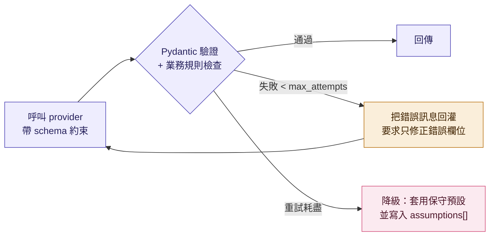

業務規則檢查指 Scheduler 的 `pacing` 上限、修訂策略的約束等——**格式對不代表內容合理**，兩層都要過。降級的保守預設：每週 3 次 × 40 分、三階段線性漸進、期程 12 週，並在計畫開頭標明是系統預設。

### 7.6 為本地模型準備的兩個調整

這兩項不論用哪個模型都做，因為它們同時也讓雲端模型更穩定：

1. **`generate_plans` 只產一份基準模板。** 原本一次要 LLM 產三份難度，對小模型太重，而且 template 還得自報 `difficulty`——它根本不知道自己是哪一份。改成產一份不帶難度標籤的模板，三份由程式依係數推導（見 4.3.1.1）。難度差異可預期，LLM 呼叫成本降三分之二。
2. **關鍵約束放 prompt 結尾。** `pacing` 上限、輸出 schema 要求、禁止事項寫在最後一段；模型對結尾的注意力普遍高於中段。

### 7.7 全系統的 LLM 呼叫點

整份設計只有四處呼叫 LLM，其餘都是純程式碼：

| prompt_name | 位置 | 每個 session 次數 | 輸出 |
|---|---|---|---|
| `evaluate_readiness` | Plan Engine，`evaluating` | 1–3（初次 + 每輪追問後） | `{ready, missing[], questions[≤5]}` |
| `generate_plans` | Plan Engine，`generating` | 1 | 一份 `hard` PlanTemplate |
| `revise_plan` | Plan Engine，`plan.revise` | 每次修訂 1 | 修訂後 template + rationale |
| `recommend_role_model` | Role Model Service | 用戶主動查詢時 1 | `[{role_model_id, reason}] × 3` |

刻意**不**交給 LLM 的：日期時間排程（Scheduler）、easy / extremely_hard 推導（係數）、role model 粗篩與計分（SQL + 程式）、修訂 diff（key 對齊比較）、Markdown 渲染、檔案解析、策略可行性判斷（過載上限）。判準是：規則寫得出來就不要交給 LLM——可測、零成本、結果穩定。

### 7.8 觀測

每次呼叫記錄：`prompt_name`、`prompt_version`、`provider`、`model`、`purpose`、input / output tokens、耗時、重試次數、是否降級。這是之後判斷「哪幾條路值得切到雲端」的唯一依據，M0 就要有。

### 7.9 Context、併發與模型驗收

- 16,384 是 input 與 output 的共同上限。組 prompt 時先保留該 purpose 的 `max_output_tokens` 與 chat template buffer，再按「必要 profile / 使用者回答 → schema / 規則 →近期 Calendar → 文件 chunks → role model 補充」排序裁切；禁止依賴 runtime 靜默截斷。
- 本機 demo 的 LLM worker concurrency 固定為 1；queue 端做 backpressure，timeout / retry 不可讓同一請求的多次 generation 重疊執行。
- 換模型前要跑四種 production schema 的固定 eval set；分別記錄 JSON parse、Pydantic、業務規則、繁中可讀性、非法 candidate ID、延遲與 fallback rate。建議 gate 與測法見 `docs/research/local-llm-evaluation.md` 第 9 節。
- Pin runtime 版本、model tag 與解析後 digest。權重授權獨立審查；runtime 的 MIT 授權不代表下載模型也是 OSI open source。

---

## 8. 程式架構：Hexagonal（Ports & Adapters）

不採完整 Clean Architecture 四層；三層即可拿到「業務邏輯不依賴框架、外部可替換」。

```
guru-core/
├── cmd/                          # 所有可執行入口，每個檔案 ≤ 30 行
│   ├── api_server.py             # FastAPI（uvicorn），API Service 的 HTTP
│   ├── api_worker.py             # ARQ worker：import.parse、export.push
│   ├── plan_engine_worker.py     # ARQ worker：plan.generate / continue / revise
│   ├── role_model_server.py      # FastAPI，Role Model Service
│   ├── seed_role_models.py       # 讀 seeds/*.yaml → 驗證 → upsert
│   └── check_llm.py              # 對設定的 provider 跑一次 smoke test
├── packages/
│   ├── llm/         # LLMPort, OpenAICompatLLM, AnthropicLLM, FakeLLM, router, prompts
│   ├── importers/   # SourcePort, ParserPort, Document
│   ├── repo/        # XxxRepo Protocols + Pg/InMemory 實作
│   ├── storage/     # StoragePort, R2Storage, InMemoryStorage
│   ├── queue/       # QueuePort, ArqQueue, InMemoryQueue
│   └── cache/       # CachePort, RedisCache, DictCache
├── services/
│   ├── api/
│   │   ├── domain/        # 純 Python，零框架 import
│   │   ├── application/   # 一個 use case 一個檔案（動詞命名）
│   │   ├── adapters/      # FastAPI routers、ARQ consumers
│   │   └── container.py   # 唯一組裝點，設定決定實作
│   ├── plan_engine/
│   │   ├── domain/        # PlanSession 狀態機、Scheduler、難度推導、指標規則
│   │   ├── application/   # evaluate_session.py, generate_plan.py, revise_plan.py
│   │   ├── adapters/      # ARQ consumers
│   │   └── container.py
│   └── role_model/
│       ├── domain/        # RoleModel、tag 規則、RoleModelRenderer、檢索計分
│       ├── application/   # recommend_role_models.py, upsert_role_model.py
│       ├── adapters/      # FastAPI router
│       └── container.py
├── config/
│   ├── llm.yaml
│   ├── readiness_metrics.yaml
│   ├── scheduler.yaml
│   ├── tag_vocab.yaml
│   └── difficulty_coefficients.yaml
├── seeds/                        # role model 起始樣本（yaml）
├── migrations/                   # Alembic
├── tests/
│   ├── unit/                     # domain 純函式：Scheduler、diff、計分、渲染
│   ├── application/              # use case × Fake adapters，不起 Docker
│   └── fixtures/                 # FakeLLM 的固定回應
├── .importlinter                 # 依賴方向 contract
├── Dockerfile                    # 單一映像，entrypoint 由 cmd/ 決定
├── docker-compose.yml            # 本地：postgres + redis +（可選）LLM 端點
├── pyproject.toml                # uv workspace
└── CONTRIBUTING.md               # 第 9 節紀律
```

### 8.1 為什麼要有 `cmd/`

三個 service 但**六個執行入口**：HTTP × 2、ARQ worker × 2、一次性腳本 × 2。沒有 `cmd/` 時這些會散在各 service 目錄裡，Dockerfile 的 entrypoint 難寫、新人也看不出系統有幾種跑法。

`cmd/` 下每個檔案只做三件事，不含任何業務邏輯：

```python
# cmd/plan_engine_worker.py
from services.plan_engine.container import build_container
from packages.queue import run_worker

async def main() -> None:
    c = build_container()                      # 讀設定、組裝 adapters
    await run_worker(
        queue=c.queue,
        handlers={
            "plan.generate":  c.generate_plan,
            "plan.continue":  c.continue_session,
            "plan.revise":    c.revise_plan,
        },
    )
```

好處是部署變成一句話：**同一個映像，換 entrypoint 就換角色**。

```dockerfile
# 所有 service 共用
ENTRYPOINT ["python", "-m"]
CMD ["cmd.api_server"]
```

`docker compose` 或雲端平台只要指定 `cmd.plan_engine_worker`、`cmd.api_worker` 就是不同的 process，不需要多個 Dockerfile，也不需要在程式裡用環境變數分支「我現在是 worker 還是 server」。

**紀律**：`cmd/` 只能 import `services/*/container.py` 與 `packages/` 的 runtime helper，不能 import use case 或 domain；`cmd/` 裡出現 `if` 判斷業務條件就是寫錯地方了。這條寫進 `.importlinter`。

### 8.2 分層

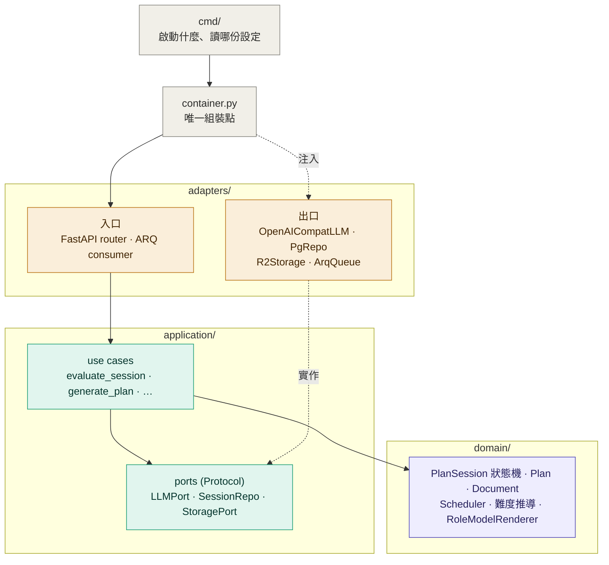

依賴方向只能 `cmd → container → adapters → application → domain`，反向一律 CI 失敗。

### 8.3 domain 裡有什麼（容易放錯的東西）

這幾樣是純函式，**必須放 domain、必須能單獨測試**，很容易被誤放進 adapters 或 use case：

| 元件 | 位置 | 為什麼是 domain |
|---|---|---|
| `Scheduler` | `plan_engine/domain/scheduler.py` | 輸入 template + 時段 + 既有行程，輸出任務列；無 IO |
| 難度推導係數 | `plan_engine/domain/difficulty.py` | 純運算，係數讀 config |
| 修訂 `diff` | `plan_engine/domain/diff.py` | 兩組任務的比較，無 IO |
| `PlanSession` 狀態機 | `plan_engine/domain/session.py` | enum + 轉移表 |
| `RoleModelRenderer` | `role_model/domain/renderer.py` | 依 purpose 與 budget 產 markdown |
| 檢索計分 | `role_model/domain/scoring.py` | tag 命中計分，SQL 過濾在 repo |
| tag 驗證 | `role_model/domain/tags.py` | 對照 `tag_vocab.yaml` |

判準：**只要不需要網路、資料庫或檔案就能算出結果，就放 domain。** 這批東西的測試佔整個測試套件的大宗，也是最能擋住回歸的部分。

---

## 9. 工程紀律（CONTRIBUTING.md）

### 9.1 邊界（用工具強制，不靠自覺）

1. 依賴方向只能 `adapters → application → domain`；反向 import 直接 CI 失敗（`import-linter` layers contract）。
2. Service 之間不能互相 import。只能透過 `packages/` 或佇列溝通；`services/plan_engine` 出現 `from services.api import ...` 即違規。
2b. `cmd/` 只能 import 各 service 的 `container.py` 與 `packages/` 的 runtime helper，不能 import use case 或 domain；`cmd/` 出現業務判斷即違規。
3. 每個共用套件只 export `__init__.py` 中的公開介面，其餘視為 private。
4. 一張表只有一個 service 能寫，其他只讀；owner 寫在表格 docstring（見 4.2）。

### 9.2 抽象（所有存儲與外部都是 port，皆可替換）

5. 以下一律定義 `Protocol`，實作放 adapters：`LLMPort`、`StoragePort`、`QueuePort`、`CachePort`、每張表的 `XxxRepo`、`SourcePort` / `ParserPort`、`CalendarPort` / `NotionPort`。Scheduler、`RoleModelRenderer`、難度推導係數屬於 domain 的純函式，不是 port——它們沒有外部依賴，必須可單獨測試。
6. 每個 port 至少兩個實作：正式版 + `InMemory` / `Fake` 版。Fake 版的目的是現在的測試不用起 Docker——這是抽象有沒有做對的驗證。
7. Port 介面只用 domain 型別，不用供應商型別。`StoragePort.put(key, bytes)` 可以，`put(boto3_object)` 不行；`LLMPort.complete()` 回 Pydantic model，不回 SDK response。
8. 供應商切換只改組裝點：每個 service 一個 `container.py`，環境變數決定實作。其他地方看不到 `boto3`、`anthropic`、`openai`、`redis` 這些字。

### 9.3 易讀性

9. 一個 use case 一個檔案，檔名是動詞：`evaluate_session.py`、`generate_followups.py`。
10. Domain 狀態機用 enum + 明確轉移表，不散落 `if status == "questioning"`。
11. 固定命名：port 叫 `XxxPort`，實作叫 `技術名 + Xxx`（`PgSessionRepo`、`R2Storage`、`OpenAICompatLLM`），use case 叫動詞。
12. `mypy --strict` 過；Pydantic 管所有進出邊界的資料（HTTP、佇列 payload、LLM 輸出）。
13. 每個 service 與套件根目錄一份 `README.md`，只回答三個問題：負責什麼、對外 port 有哪些、不負責什麼。

### 9.4 變更紀律

14. 加新的外部整合 = 加一個 adapter + 改 container，不改 use case；若需改 use case，代表 port 設計錯了，先修 port。
15. DB schema 只透過 Alembic migration 改，migration 與功能同一 PR。
16. 佇列 payload 是版本化 Pydantic model；加欄位可以，改語意要開新版本。
17. 任務狀態的權威來源在 PostgreSQL，Redis 只當快取；Redis 清空不能導致任何 session 或 job 消失。

### 9.5 CI 必過清單

`ruff` → `mypy --strict` → `import-linter`（含 `cmd/` 那條）→ `pytest`（unit + application，皆不起 Docker）→ `alembic check`

---

## 10. 非功能需求

| 項目 | 目標 |
|---|---|
| Plan 生成延遲 | 雲端 provider：evaluating ≤ 30s、generating ≤ 60s。本地 provider 視硬體放寬至 evaluating ≤ 90s、generating ≤ 180s；App 一律以輪詢承接，不假設同步回應 |
| Follow-up 上限 | 2 輪 × ≤5 題 |
| LLM 輸出 | provider 端 schema 約束 + Pydantic 驗證 + 業務規則檢查；失敗回灌錯誤重試 ≤`retry.max_attempts` 次，耗盡則降級為保守預設並寫入 `assumptions[]` |
| 資料隔離 | 所有查詢帶 `user_id`，repo 層強制 |
| 檔案上限 | 單檔 20 MB，presigned URL 15 分鐘有效 |
| 可觀測性 | 每個 job 有 `job_id` 貫穿 log；LLM 呼叫記錄 provider、model、prompt 版本、token、重試次數與是否降級（見 7.7） |

---

## 11. 里程碑

| 階段 | 交付 | 驗收 |
|---|---|---|
| M0 骨架 | monorepo、三個 service 空殼、六個 port + Fake 實作、`llm` 套件的 provider 路由與觀測、CI 全綠 | `import-linter`、`mypy` 通過；所有 use case 可用 Fake 跑測試；改 `config/llm.yaml` 的 provider 設定能在本地與雲端間切換 |
| M1 輸入 | Auth、Profile、Upload 匯入（csv / md / pdf）、Google Calendar 匯入 | Document 正確落 DB |
| M2 引擎 | Plan Engine 完整狀態機、follow-up loop、LLM 產 hard + 程式推導另兩份、Scheduler 展開成 plan_tasks | 端到端從「只填目標」到三份 plans 與可勾選的 tasks |
| M3 Role model | 寫入 API、seed 特質類 3 筆 + 角色卡類 9 筆、列表 / 篩選、LLM 推薦 ≤3 | Plan Engine 能納入特質 + 角色卡 context |
| M4 管理與輸出 | Google 連線管理、計畫列表 / 啟用 / 封存 / 刪除、內建 Todo、每日 check-in、匯出 Google Calendar（含增量同步）與 Markdown | 匯出後 `plan_tasks.external_ref` 回填；任務改動後 Calendar 同步 |
| M4.5 修訂 | 手動觸發修訂、`postpone` / `reduce` 兩種策略、Plan Engine 產修訂與 diff、accept / reject | 標記 missed 後可觸發修訂，看 diff 並套用，套用後 Calendar 同步 |
| M5 硬化 | 重試、限流、observability、Notion 匯出（P1） | 可上線 |

---

## 12. Role model 資料設計（以 LLM harness / RAG 為出發點）

### 12.1 設計原則

Role model 的資料不是給人讀的文章，是**要被檢索、被裁切、被塞進 prompt 的結構化 context**。四個原則：

1. **可過濾（filter）**：硬條件用結構化欄位與帶命名空間的 tag，不靠 LLM 讀全文猜。
2. **可挑選（rank）**：`summary` 專門為 LLM 挑選寫，短而密；候選變多時再加計分或 embedding 層。
3. **可裁切（render）**：`description` 拆成固定區塊，Plan Engine 依 token 預算與用途挑區塊塞，不是整篇貼。
4. **可追溯（provenance）**：來源、信心、版本都帶著，LLM 知道該多相信這份資料，session 也能重現當時用的版本。

### 12.2 兩大類

| kind | 意義 | 進 prompt 的方式 |
|---|---|---|
| `trait` 基本特質類 | 執行風格與強度基調，跨領域 | 主要是**數值約束**（`pacing`），直接變成生成計畫時的硬限制；prose 只佔一小段 |
| `persona` 角色卡類 | 具體人物 / 人設的方法論 | 主要是**結構化 prose 區塊**（原則、每週結構、進度指標、失敗點），LLM 拿來當方法論參考 |

### 12.3 Tag 命名空間

Tag 統一存成 `namespace:value`，小寫英文、連字號。命名空間決定用途：

| namespace | 用途 | 值（受控詞彙，放 `config/tag_vocab.yaml`） | 例 |
|---|---|---|---|
| `domain:` | 硬過濾 | 開放，由匯入方決定（`fitness`, `learning`, `investing`, `music`, `career`…） | `domain:fitness` |
| `goal:` | 硬過濾，目標型態 | 開放（`fat-loss`, `endurance`, `skill`, `exam`, `language`, `saving`…） | `goal:endurance` |
| `method:` | 軟匹配，方法論特徵 | 開放（`periodization`, `80-20`, `comprehensible-input`, `project-based`, `dca`…） | `method:80-20` |
| `level:` | 軟匹配，適合起點 | `beginner`, `intermediate`, `advanced` | `level:beginner` |
| `cadence:` | 軟匹配，節奏 | `daily`, `3x-week`, `5x-week`, `weekly-review` | `cadence:daily` |
| `horizon:` | 軟匹配，期程 | `weeks`, `months`, `years` | `horizon:months` |
| `constraint:` | 硬排除，不適合的情況 | `no-gym`, `injury-sensitive`, `low-capital`, `fixed-deadline` | `constraint:no-gym` 代表此角色卡**需要**健身房，用戶沒有就排除 |
| `persona:` | 顯示與同義，不參與過濾 | 自由文字 | `persona:basketball`, `persona:nba` |

規則：`domain` 與 `goal` 是硬過濾（SQL `WHERE`），`constraint` 是硬排除，其餘只影響排序分數。

**沒有預設 category，tag 是唯一的分類機制**，且由匯入時決定。`config/tag_vocab.yaml` 只規範**命名空間**清單（prefix 不在清單內就拒絕寫入），值本身開放新增；新值第一次出現時記錄進詞彙表，供前端篩選與寫入提示，避免同義詞氾濫（如 `running` 與 `run` 並存）。新領域只要用新的 `domain:` 值，不用改 schema 或 config。

**`config/tag_vocab.yaml` 初版（寬鬆模式）**

```yaml
version: 1
mode: lenient          # lenient：prefix 白名單，值自由；strict：值也要在清單內（之後再切）

namespaces:            # 白名單，prefix 不在此清單一律拒絕寫入
  - domain             # 硬過濾
  - goal               # 硬過濾
  - method             # 軟匹配
  - level              # 軟匹配
  - cadence            # 軟匹配
  - horizon            # 軟匹配
  - constraint         # 硬排除
  - persona            # 顯示與同義，不參與過濾

value_rules:
  pattern: "^[a-z0-9]+(-[a-z0-9]+)*$"   # 小寫、數字、連字號
  max_length: 32
  max_tags_per_record: 12

enum_only:             # 這幾個命名空間的值仍受限，因為程式會拿來計分
  level: [beginner, intermediate, advanced]
  horizon: [weeks, months, years]
  cadence: [daily, 3x-week, 5x-week, weekly-review, monthly-review]

known_values:          # 只是紀錄，寫入新值會自動追加，供前端篩選與寫入提示
  domain: [fitness, learning, investing]
  goal: [fat-loss, muscle, endurance, skill, exam, language, programming, saving, wealth-building]
  method: [periodization, high-reps, 80-20, comprehensible-input, project-based,
           spaced-repetition, dca, value-investing, budgeting]
  constraint: [no-gym, injury-sensitive, low-capital, fixed-deadline, no-equipment]
  persona: []          # 自由文字，不記錄

required_tags:
  persona: [domain, goal]    # 角色卡至少要有 domain: 與一個 goal:
  trait: []                  # 特質類不強制
```

`level` / `horizon` / `cadence` 用 enum 是因為排序程式會直接比對這幾個值；其餘走 lenient，讓匯入方自由擴充。等 tag 累積到需要治理時再把 `mode` 切成 `strict`。

### 12.4 資料格式

單一 JSONB 欄位 `content` 存結構，外層幾個欄位拉出來給 SQL 用。

```yaml
# ---- 外層欄位（SQL 可查）----
id: uuid
kind: trait | persona
name: string
tags: string[]                              # namespace:value，唯一分類機制，GIN index
                                            # persona 必填 domain: 與 ≥1 個 goal:；trait 可只帶 cadence:/level:
active: bool
updated_at: timestamp

# ---- content（JSONB）----
content:
  summary: string            # 1–2 句，給列表與 LLM 挑選；≤ 60 字

  # ---- trait 專用：數值約束，Plan Engine 直接當硬限制 ----
  pacing:
    sessions_per_week: [min, max]
    session_minutes: [min, max]
    rest_days_min: int
    progression_rate: float          # 每兩週增量上限，0.10 = 10%
    missed_policy: none | same-week | next-day
    deload_every_weeks: int | null
    intensity_bias: low | medium | high   # 追問與生成時的預設強度

  # ---- persona 專用：結構化 prose 區塊 ----
  sections:
    principles: string[]           # 3–5 條，每條一句
    weekly_structure: string       # 一週長什麼樣，≤ 150 字
    progress_metrics: string[]     # 怎麼知道有進步，2–3 條
    pitfalls: string[]             # 常見失敗點，2–4 條
    applicability:
      good_for: string[]           # 什麼人適合
      not_for: string[]            # 什麼人不適合
    example_milestones: string[]   # 2–3 個具體里程碑，含數字

  # ---- 共同：來源與信心（選填，但建議填）----
  provenance:
    sources: [{title, url}]             # 方法論的公開出處，可為空陣列
    confidence: high | medium | low     # 影響 LLM 該多信任這份內容；未填視為 medium
    author: string | null               # 匯入方自行標記
    notes: string | null
```

`trait` 沒有 `sections`（或只填 `principles`），`persona` 沒有 `pacing`。用 Pydantic discriminated union 驗證，寫入時型別不對直接拒絕。**必填只有 `summary`**，讓外部匯入的門檻夠低。

### 12.5 推薦流程

Seed 量在數十筆的規模，不需要檢索管線。**SQL 硬過濾之後，把剩下的全部丟給 LLM 挑三個。**

```
用戶 profile
   │
   ▼
① 硬過濾（SQL）
   kind = persona AND active
   AND tags ∩ {domain:<由用戶目標推出>} ≠ ∅
   AND NOT tags ∩ {constraint:<用戶不符合的條件>}
   LIMIT 30                                          → 通常剩 3–15 筆
   │
   ▼
② LLM 挑選（唯一的 LLM 呼叫）
   輸入：profile + 候選的 {id, name, tags, summary, applicability}
   輸出：前 3 名 + 每筆一句理由（JSON schema）
```

`goal:` 不進硬過濾——只用 `domain:` 收斂，剩下的判斷交給 LLM，避免 tag 標得不準時把對的候選濾掉。

**什麼時候要加回排序層**：候選穩定超過 30 筆時，先加 tag 計分（`method` 命中 ×3、`level` 相符 ×2）取前 8 再給 LLM；破百筆再考慮 pgvector。tag 結構已經在了，那時加不用改 schema。

### 12.6 Plan Engine 的 context 渲染

Plan Engine 不直接貼 JSON，透過 `RoleModelRenderer.to_context(role_model, purpose, budget_tokens)` 產出 markdown 區塊：

| purpose | 塞哪些區塊 | 預算 |
|---|---|---|
| `evaluate`（追問階段） | trait 的 `pacing.intensity_bias`；persona 的 `summary` + `applicability` | ≤ 150 tokens |
| `generate`（生成計畫） | trait 的整份 `pacing`（渲染成約束句）；persona 的 `principles` + `weekly_structure` + `progress_metrics` + `pitfalls` + `example_milestones` | ≤ 600 tokens |
| `revise`（修訂） | trait 的 `pacing.missed_policy` + `progression_rate`；persona 的 `pitfalls` + `weekly_structure` | ≤ 300 tokens |

渲染順序固定、超出預算就從尾端截區塊（不截句子中間）。渲染結果寫進 `plan_sessions.context_snapshot`——那份快照就是可重現性的來源，role model 之後改了也不影響舊 session。

Trait 的 `pacing` 渲染成約束句的例子：

> 節奏約束：每週 4–5 次，每次 30–60 分鐘，至少休息 2 天；每兩週增量不超過 10%；漏做的任務在同週補一次；預設強度中等。

### 12.7 寫入方式

MVP 沒有背景調查與用戶發布，資料全由團隊透過 `POST /role-models`（API key）寫入或跑 seed script（yaml → Pydantic 驗證 → upsert）。寫入時自動驗證 tag 命名空間與 schema。之後要加自動調查或用戶發布，只是多一個 producer 產同樣格式，推薦與渲染端不用改。

---

## 13. Readiness 指標（`config/readiness_metrics.yaml`）

### 13.1 這份清單在回答什麼

> 本節為定稿版（v2）。指標由 `PlanTemplate` 欄位反推，不依賴領域分類；新增領域不需改動此檔。

只有一個問題：**LLM 要產出一份能排進行事曆、能被勾選完成的計畫，最少需要知道什麼？** 直接對照 4.3.1 的 `PlanTemplate` 欄位反推：

| PlanTemplate 欄位 | 沒有這項資訊就填不出來 |
|---|---|
| `goal_statement`、`success_criteria` | 目標與達成標準 |
| `duration_weeks`、`phases[].week_start/end` | 期程或截止日 |
| `weekly_template[].day_hint / slot_hint / duration_minutes` | 每週次數、單次時長、可用時段 |
| `phases[].milestone.metric` | 目前起點（不知道現在在哪，里程碑訂不出來） |

這四項是 `required`，缺一不產。其餘缺了可用預設補、在 `assumptions[]` 標註，是 `helpful`。

**不做固定的分類必填清單。** 領域千變萬化，寫死在 config 只會漏，也跟 role model 只有 tag、沒有預設 category 的設計不一致。改成 `domain_probe`：讓 LLM 依用戶目標自行判斷「這個領域不先問清楚就會出錯的事」，最多提 2 項，走一般追問流程。

追問優先順序：`required` → `domain_probe` → `helpful`，每輪最多 5 題，最多 2 輪。

### 13.2 清單

```yaml
version: 2
max_followup_rounds: 2
max_questions_per_round: 5
options_per_question: 3
ask_order: [required, domain_probe, helpful]

required:
  - id: goal_outcome
    name: 目標與達成標準
    fills: goal_statement, success_criteria
    check: 有明確結果與可判斷達成的標準（數字、事件或可驗證狀態）
    bad_example: 我想變強壯 / 我想學英文
    good_example: 三個月內 5 公里跑進 30 分 / 半年內多益 750
  - id: horizon
    name: 期程
    fills: duration_weeks, phases
    check: 有截止日或大致期程；或明確表示「無期限、想穩定進行」（此時預設 12 週）
  - id: capacity
    name: 每週投入量與可用時段
    fills: weekly_template.day_hint / slot_hint / duration_minutes
    check: 同時知道「每週幾次」「每次多久」「大致什麼時段」；三者缺一都算未滿足
  - id: baseline
    name: 目前起點
    fills: phases[].milestone.metric
    check: 對目標領域的現況有描述，最好有數字（目前 5K 38 分 / 多益 550 / 每月可存 1 萬）

domain_probe:
  id: domain_specific
  name: 領域關鍵前提
  max_items: 2
  instruction: |
    依用戶目標判斷：這個領域若不先問清楚，產出的計畫可能無效、無法執行或造成傷害。
    只挑最多 2 項最關鍵的，且必須是 required 與 helpful 未涵蓋的。
    問法與其他追問一致：三個依 context 客製的選項，可 skip 或自由回答。
  examples_for_llm:
    - 目標涉及體能訓練 → 是否有傷病或醫囑限制、有無場地器材
    - 目標涉及資金配置 → 可投入金額、能接受的最大回撤
    - 目標涉及考試 → 考試日期是否已定、是否已報名
    - 目標涉及作品產出 → 產出形式與發表管道
  note: 不預先列舉領域；LLM 判斷不出來就回空陣列

helpful:
  - id: existing_schedule
    name: 既有行程
    check: 已連結 Calendar，或用戶自行描述固定行程
    default: 只用用戶宣告的可用時段排程
    note: 未連結 Calendar 時永遠未滿足，但不追問，只在 assumptions[] 標註
  - id: difficulty_preference
    name: 強度偏好
    check: 想衝刺還是穩定累積、能接受多大程度的生活改變
    default: 中等強度；三份難度仍照 Easy / Hard / Extremely hard 產出
  - id: accountability
    name: 督促方式
    check: 需要提醒、打卡、夥伴，還是自律即可
    default: 每日提醒 + 每週回顧
  - id: time_method
    name: 慣用時間管理法
    check: 番茄鐘、時間塊、每日 top-3 等
    default: 時間塊
  - id: past_attempts
    name: 過去嘗試
    check: 試過什麼、為何中斷
    default: 假設首次嘗試
  - id: constraints
    name: 一般限制
    check: 出差、季節、預算、家庭等會影響排程的固定因素
    default: 假設無特殊限制
  - id: role_model_fit
    name: 角色卡契合
    check: 所選角色卡的 tags 與目標有交集
    default: 忽略角色卡，只依目標與特質生成

ready_rule: 四項 required 全部滿足即 ready；domain_probe 與 helpful 不阻擋
force_generate_rule: |
  追問輪數用完仍不 ready 時，required 缺項以最保守假設補上（期程預設 12 週、
  capacity 預設每週 3 次 × 30 分、起點預設初學），全部寫進 assumptions[]，
  並在計畫開頭提示「以下項目為系統假設，建議補完後重新規劃」。
```

### 13.3 追問題目生成規則（給 prompt 用）

- 一題只補一個指標，不合併問。
- 三個選項要從用戶已有 context 推出來，不是通用選項。例：已知用戶是上班族、目標跑步，`capacity` 的選項應是「平日 2 晚 + 週六早上，每次 40 分」而不是「少於 3 小時 / 3–7 小時 / 7 小時以上」。
- 每題都可 skip 或自由回答；skip 視為缺項，走 `force_generate_rule`。
- 第 2 輪只問第 1 輪後仍缺的項目，不重問。
- 已能從基本題、上傳資料或（若已連結）Calendar 推出的資訊，不再追問。

---

## 14. Role model tag 與首批 seed

### 14.1 分類方式

**沒有預設 category**，分類完全由 tag 決定（見 12.3）。首批 seed 用到的 `domain:` 是 `fitness`、`learning`、`investing`，那只是首批內容的範圍，不是系統限制；之後加音樂、職涯、寫作只要用新的 `domain:` 值。

### 14.2 首批 seed

**基本特質類（3 筆，跨領域）**

| # | 名稱 | summary | description 重點 |
|---|---|---|---|
| T1 | 輕鬆寫意型 | 低壓力、可持續，寧可慢也不中斷 | 每週 2–3 次、單次不超過 45 分、每週至少 2 天完全休息、missed 不補、以連續週數為指標 |
| T2 | 穩扎穩打型 | 固定節奏、線性漸進 | 每週 4–5 次、每兩週增量 ≤10%、每週回顧一次、missed 於當週補一次 |
| T3 | 地獄模式型 | 短期高強度衝刺 | 每週 6 次、每次 60–90 分、每 3 週一次減量週、missed 隔日補、以里程碑達成日為指標 |

**角色卡類（9 筆）**

| # | 名稱 | tags | summary |
|---|---|---|---|
| P1 | Stephen Curry 型 | domain:fitness, goal:skill, method:high-reps, level:intermediate, cadence:daily, horizon:months, persona:basketball | 高重複次數的專項技術練習，以命中率為週指標 |
| P2 | Eliud Kipchoge 型 | domain:fitness, goal:endurance, method:periodization, method:80-20, level:intermediate, cadence:5x-week, horizon:months, persona:running | 80/20 低強度為主、週期化漸進、每週一次長距離 |
| P3 | 上班族減脂型 | domain:fitness, goal:fat-loss, method:periodization, level:beginner, cadence:5x-week, horizon:months, constraint:no-gym | 每週 3 肌力 + 2 有氧、每日蛋白質目標、雙週量測 |
| P4 | Steve Kaufmann 型 | domain:learning, goal:language, method:comprehensible-input, level:beginner, cadence:daily, horizon:years | 大量可理解輸入、每日聽讀、不背文法 |
| P5 | Scott Young 型 | domain:learning, goal:programming, goal:skill, method:project-based, level:intermediate, cadence:daily, horizon:months | 先拆技能地圖、直接練目標任務、以專案產出驗收 |
| P6 | 在職考證照型 | domain:learning, goal:exam, method:spaced-repetition, level:beginner, cadence:5x-week, horizon:months, constraint:fixed-deadline | 前 2/3 讀完範圍、後 1/3 全做題、每週模擬考 |
| P7 | Warren Buffett 型 | domain:investing, goal:wealth-building, method:value-investing, level:advanced, cadence:weekly-review, horizon:years | 只投看得懂的、長期持有、每年檢視 |
| P8 | John Bogle 型 | domain:investing, goal:wealth-building, method:dca, level:beginner, cadence:weekly-review, horizon:years | 低成本指數、定期定額、股債比隨年齡調整 |
| P9 | 存第一桶金型 | domain:investing, goal:saving, method:budgeting, level:beginner, cadence:weekly-review, horizon:years, constraint:low-capital | 先補緊急預備金、固定儲蓄率、達標後轉定期定額 |

**特質類的 `pacing` 對照（T1–T3）**

| # | sessions_per_week | session_minutes | rest_days_min | progression_rate | missed_policy | deload_every_weeks | intensity_bias |
|---|---|---|---|---|---|---|---|
| T1 輕鬆寫意 | [2, 3] | [20, 45] | 2 | 0.05 | none | null | low |
| T2 穩扎穩打 | [4, 5] | [30, 60] | 1 | 0.10 | same-week | null | medium |
| T3 地獄模式 | [6, 6] | [60, 90] | 1 | 0.15 | next-day | 3 | high |

上表只是 seed script 的起始樣本，**內容由外部透過 `POST /role-models` 增刪維護，PRD 不負責維護這份清單**。寫入端唯一強制的是 schema 與 tag 規則（見 12.3、12.4）；`sections` 建議寫「做法」而非「生平」，因為 Plan Engine 只用得到可執行的方法論。以下各給一筆完整 `content` 範例供對格式。

**特質類範例（T2 穩扎穩打型）**

```yaml
kind: trait
name: 穩扎穩打型
tags: [cadence:5x-week, level:beginner, horizon:months]
content:
  summary: 固定節奏、線性漸進，寧可慢一點也要每週都動。
  pacing:
    sessions_per_week: [4, 5]
    session_minutes: [30, 60]
    rest_days_min: 1
    progression_rate: 0.10
    missed_policy: same-week
    deload_every_weeks: null
    intensity_bias: medium
  provenance:
    sources: []
    confidence: medium
    author: guru team
    notes: 團隊定義的執行風格，非特定人物
```

**角色卡類範例（P2 Eliud Kipchoge 型）**

```yaml
kind: persona
name: Eliud Kipchoge 型
tags: [domain:fitness, goal:endurance, method:periodization, method:80-20,
       level:intermediate, cadence:5x-week, horizon:months, persona:running,
       persona:marathon]
content:
  summary: 八成訓練量放在輕鬆配速，靠週期化與每週一次長距離累積耐力。
  sections:
    principles:
      - 八成的訓練量以能邊跑邊講話的輕鬆配速進行。
      - 每週只安排一到兩次高強度課表，其餘全是輕鬆跑。
      - 訓練量以週為單位漸進，每次增量不超過前一週的一成。
      - 恢復與睡眠視為訓練的一部分，不是有空才做。
    weekly_structure: >
      一週五次：三次輕鬆跑（30–50 分）、一次強度課（間歇或節奏跑）、
      一次長距離慢跑（週末，時間逐週延長）。其餘兩天完全休息或輕度伸展。
    progress_metrics:
      - 同一配速下的心率逐週下降
      - 長距離跑的持續時間逐週增加
      - 每四週一次固定距離計時，比較完成時間
    pitfalls:
      - 輕鬆跑跑太快，導致沒有真正的恢復日
      - 週跑量增加過快造成脛骨或膝蓋疼痛
      - 只練長距離、忽略強度課，配速停滯
    applicability:
      good_for: [想首馬完賽者, 想突破 5K/10K 個人紀錄者, 每週能跑四次以上者]
      not_for: [有未癒合下肢傷勢者, 每週只能運動兩次者, 主要目標是增肌者]
    example_milestones:
      - 第 4 週：能連續慢跑 45 分鐘不停
      - 第 8 週：完成一次 12 公里長距離
      - 第 12 週：5 公里計時較起始成績進步 8% 以上
  provenance:
    sources:
      - title: 公開報導與訪談整理的耐力訓練原則
        url: https://example.com/placeholder
        accessed_at: 2026-09-05
    confidence: medium
    author: guru team
    notes: 取公開可查證的訓練原則，不含個人生平與未公開細節
```

---

## 15. 待決事項

- 託管平台（後續討論）
- 本地推論已選定 Ollama + `qwen3.5:9b` 作 demo baseline；正式部署 runtime 與模型仍由實際流量、品質 eval 與 GPU 預算決定
- v0.2 候選（皆已從 MVP 移除）：Calendar 變化偵測、每日自動修訂、`compress` 策略、role model 排序層
